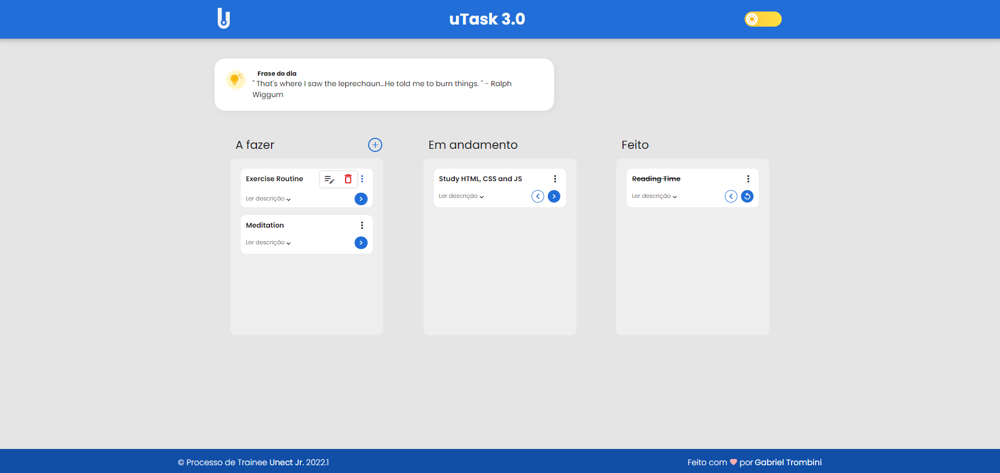
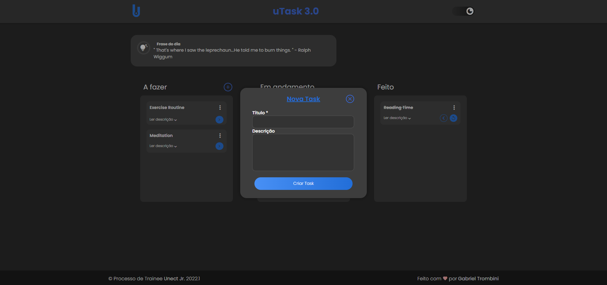

# Kanban site

First project for trainees at UNECT JR junior company, where the challenge is to develop a kanban aimed at organizing day-to-day tasks using only the following technologies: HTML, CSS, and JS.

the project is available at: [Kanban site](https://str0mg.github.io/Site-Unect/)

## This project includes all mandatory features listed below:

- Adding at least one simple form validation with visual error feedback.
- Functional carousel.
- Responsiveness.
- The structure for storing tasks should be an array of tasks (using the push method).

## Following ES6 standard in JavaScript, especially:

- Using "let" and "const" instead of "var".
- Arrow functions.
- Utilizing template strings with data interpolation for DOM manipulation.
- Prioritizing the use of flexbox in CSS (display: flex;).

## And some extras:

- Dark theme.
- Consumption of the "Quote of the Day" API.

